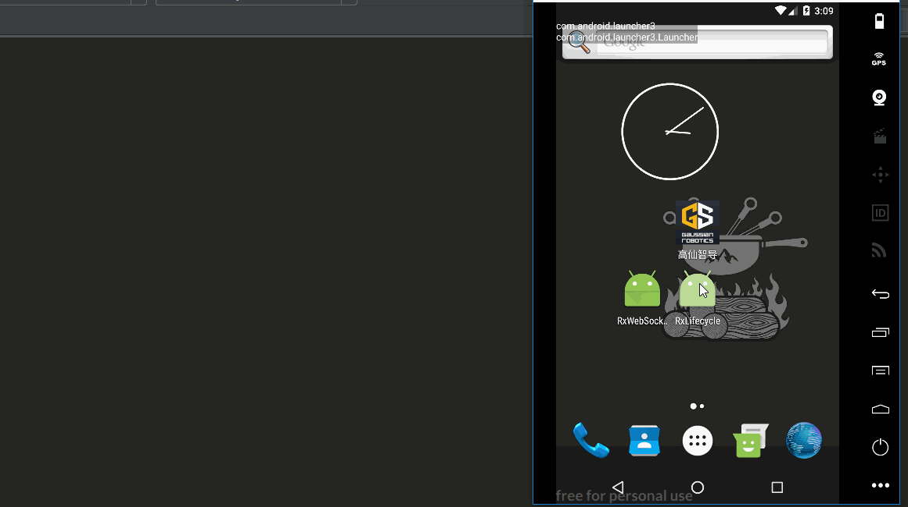

# RxLifecycle #
## 原理解析:[戳我试试](http://blog.csdn.net/huiAndroid/article/details/78116228)
## RxLifecycle是一个轻量级,侵入性低的RxJava注销管理库.
[](https://developer.android.com/index.html) 
[  ](https://bintray.com/dhhandroid/maven/rxlifecycle/_latestVersion)
[  ](https://developer.android.com/about/versions/android-4.0.html)
[  ](http://www.apache.org/licenses/LICENSE-2.0)
## feature
 - 轻量:整个库只有24k.
 - 入侵性低:不改变原来项目架构,继承体系,仅需OBservable事件流上加入本库即可.
 - 适用于基于RxJava开发的任何三方库,如RxBus,RxBinding,以及本人的另外两个库,[RxWebSocket(WebSocket自动重连库)](https://github.com/dhhAndroid/RxWebSocket),[RxProgressManager(网络层基于okhttp的上传下载进度监听库)](https://github.com/dhhAndroid/RxProgressManager) 等等.
 - 对于RxJava+Retrofit请求框架,有[RxLifecycle-Retrofit拓展模块](https://github.com/dhhAndroid/RxLifecycle/blob/master/rxliffecycle-retrofit.md),从retrofit层自动注销网络情况(统一绑定到Activity销毁时取消所有正在进行的网络请求).
 - 支持RxJava1.x和RxJava2.x.

### 效果图

## how to use 

### gradle(请以上面显示最新版本为准,根据自己使用的RxJava版本选择一个版本)
```
	  //RxJava1版本
	  compile 'com.dhh:rxlifecycle:1.5'
	  //RxJava2版本
	  compile 'com.dhh:rxlifecycle2:1.5'

```
## RxJava2和RxJava1 的使用方法完全一样,以RxJava1库为例.
### 如果你有一个BaseActivity,仅需在BaseActivity的onCreate方法里注入RxLifecycle: 
```

	    @Override
	    protected void onCreate(Bundle savedInstanceState) {
	        super.onCreate(savedInstanceState);
			RxLifecycle.injectRxLifecycle(this);
	
	    }
```
### 既然你有一个BaseActivity,可以将RxLifecycle代码封装一下: ###
```

	    private <T> LifecycleTransformer<T> bindToLifecycle() {
	        return RxLifecycle.with(this).bindToLifecycle();
	    }
	
	    private <T> LifecycleTransformer<T> bindOnDestroy() {
	        return RxLifecycle.with(this).bindOnDestroy();
	    }
	
	    private <T> LifecycleTransformer<T> bindUntilEvent(ActivityEvent event) {
	        return RxLifecycle.with(this).bindUntilEvent(event);
	    }

		//use
	    @Override
	    protected void onStart() {
	        super.onStart();
	        Observable.just(1)
					//use		
	                .compose(bindToLifecycle())
	                .subscribe();
	    }

```
### 或者你已经有了继承Application的操作,你也可以这样注入RxLifecycle: 
```

		public class RxLifecycleAPP extends Application {
		    @Override
		    public void onCreate() {
		        super.onCreate();
		        RxLifecycle.injectRxLifecycle(this);
		    }
		}

```
## **注意:** 

### 1. 以上两种注入RxLifecycle的方式,实现一种就可以了,同时实现也没有问题,如果你乐意! 
### 2. 如果你不在Activity的"onPause"生命周期及其以后的生命周期里订阅一个Observable,注入RxLifecycle的步骤可以省略不做.如果在Activity的"onPause"生命周期及其以后的生命周期里订阅一个Observable,并且使用RxLifecycle.with(this).bindToLifecycle(),必须进行RxLifecycle注入步奏.代码说明:
```

    @Override
    protected void onPause() {
        super.onPause();
        Observable.just("dhhAndroid")
				//其他方式绑定不用预先注入
                .compose(RxLifecycle.with(this).<String>bindOnDestroy())
                .subscribe();
        Observable.just(1)
				//在onPause及其以后生命周期,使用bindToLifecycle()必须先注入RxLifecycle
                .compose(RxLifecycle.with(this).<Integer>bindToLifecycle())
                .subscribe();
    }

```
### 3. 为了简化和保险,可以忽略第二条,全部注入,第二条就当我在瞎BB,原因在博客里有讲解.
## 如果你使用的是RxJava+Retrofit网络框架,有更好的选择方式,项目里提供了Retrofit模块,从Retrofit层自动注销RxJava:[RxLifecycle-Retrofit模块](https://github.com/dhhAndroid/RxLifecycle/blob/master/rxliffecycle-retrofit.md)
### use in activity or fragment: 
### 仅仅需要在你原先的Observable事件流上用compose操作符加上如下代码:
```

 		Observable.timer(10, TimeUnit.SECONDS)
				//自动判断生命周期
                .compose(RxLifecycle.with(this).<Long>bindToLifecycle())
                .subscribe();
                
 		Observable.timer(10, TimeUnit.SECONDS)
                //当activity onStop 注销
                .compose(RxLifecycle.with(this).<Long>bindUntilEvent(ActivityEvent.onStop))
                .subscribe();
        Observable.just("dhhAndroid")
                //当activity onDestroy 注销
                .compose(RxLifecycle.with(this).<String>bindOnDestroy())
                .subscribe();
```
### use in your View ###
### 如果你在自定义view的时候里面使用的RxJava,以及View内部有retrofit+RxJava的网络访问,以及RxJava操作的耗时数据转换,同样支持一行代码管理RxJava自动注销,用法和在activity和fragment里一样: ###
```

		public class MyView extends View {
			//other...

			public void doSomething(){
		 		Observable.timer(10, TimeUnit.SECONDS)
						//自动判断生命周期
		                .compose(RxLifecycle.with(this).<Long>bindToLifecycle())
		                .subscribe();
		                
		 		Observable.timer(10, TimeUnit.SECONDS)
		                //当activity onStop 注销
		                .compose(RxLifecycle.with(this).<Long>bindUntilEvent(ActivityEvent.onStop))
		                .subscribe();
		        Observable.just("dhhAndroid")
		                //当activity onDestroy 注销
		                .compose(RxLifecycle.with(this).<String>bindOnDestroy())
		                .subscribe();
				....
			}		
		}


```

### use in MVP  ###
### 在MVP架构或者其他地方使用RxLifecycle时,仅需确保所使用的地方能获取到一个能转化成Activity的Context即可. 项目里我写了一个with重载方法可传入任意对象,只要能转化成Context,或者通过反射能获取到所传对象的成员变量有能转化成Context(Activity),也可实现RxJava生命周期自动绑定,但考虑到性能问题暂未开放(private方法).代码如下:

```

    private static LifecycleManager with(Object object) {
        if (object instanceof Context) {
            return with((Context) object);
        }
        for (Field field : object.getClass().getDeclaredFields()) {
            try {
                field.setAccessible(true);
                Object value = field.get(object);
                if (value instanceof Context) {
                    return with((Context) value);
                }

            } catch (IllegalAccessException e) {
                e.printStackTrace();
            }
        }
        throw new ClassCastException(object.getClass().getSimpleName() + " can\'t convert Context !");
    }

```
#### 参考项目:
- [RxLifecycle](https://github.com/trello/RxLifecycle)
- [Glide](https://github.com/bumptech/glide)
## License
```

   Licensed under the Apache License, Version 2.0 (the "License");
   you may not use this file except in compliance with the License.
   You may obtain a copy of the License at

       http://www.apache.org/licenses/LICENSE-2.0

   Unless required by applicable law or agreed to in writing, software
   distributed under the License is distributed on an "AS IS" BASIS,
   WITHOUT WARRANTIES OR CONDITIONS OF ANY KIND, either express or implied.
   See the License for the specific language governing permissions and
   limitations under the License.
```